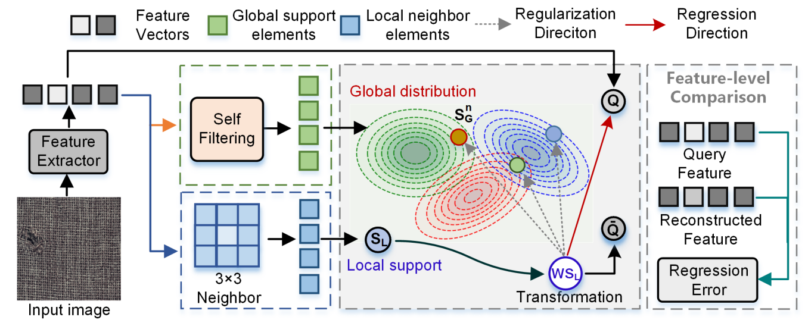
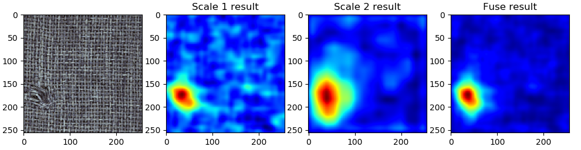

# GRNR
Official implementation of the paper "Global-Regularized Neighborhood Regression for Efficient Zero-Shot Texture Anomaly Detection"
## Global-Regularized Neighborhood Regression for Efficient Zero-Shot Texture Anomaly Detection
IEEE Transactions on Systems, Man and Cybernetics: Systems(under review)
## GRNR Framework

## BibTex Citation
If you like our paper or code, please use the following BibTex:

@article{yao2024global,
  title={Global-Regularized Neighborhood Regression for Efficient Zero-Shot Texture Anomaly Detection},
  author={Yao, Haiming and Luo, Wei and Cao, Yunkang and Zhang, Yiheng and Yu, Wenyong and Shen, Weiming},
  journal={arXiv preprint arXiv:2406.07333},
  year={2024}
}

## Demo
- Directly running the python code main.py(Please specify the test image path before running), you will get the results:

## To do
The complete code and dataset will be fully open after the paper is accepted. Hope all goes well.
