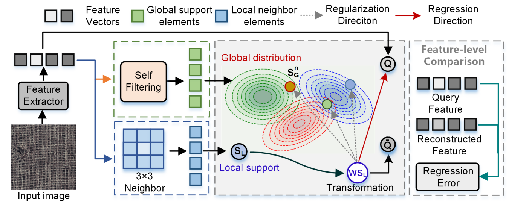
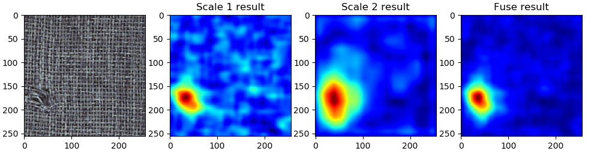

# GRNR
Official implementation of the paper "Global-Regularized Neighborhood Regression for Efficient Zero-Shot Texture Anomaly Detection"
## Global-Regularized Neighborhood Regression for Efficient Zero-Shot Texture Anomaly Detection
IEEE Transactions on Systems, Man and Cybernetics: Systems 2025
## GRNR Framework

## BibTex Citation
If you like our paper or code, please use the following BibTex:

@article{yao2025global,
  title={Global-regularized neighborhood regression for efficient zero-shot texture anomaly detection},
  author={Yao, Haiming and Luo, Wei and Cao, Yunkang and Zhang, Yiheng and Yu, Wenyong and Shen, Weiming},
  journal={IEEE Transactions on Systems, Man, and Cybernetics: Systems},
  year={2025},
  publisher={IEEE}
}
## Demo
- Directly running the python code main.py(Please specify the test image path before running), you will get the results:

